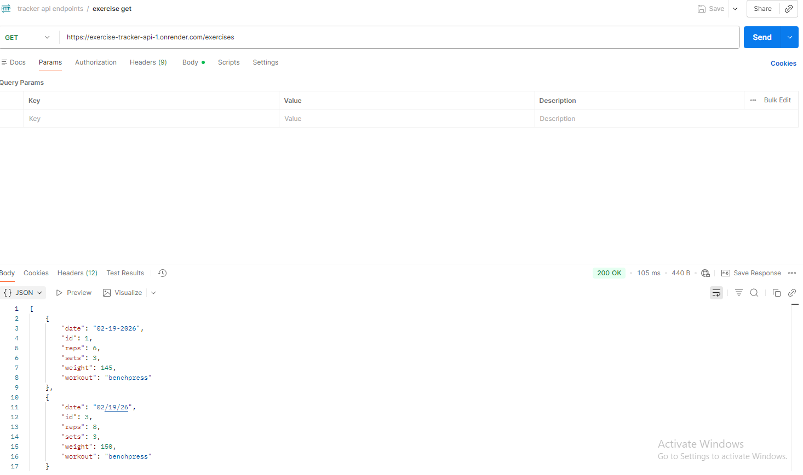

# Exercise Tracker API

Simple exercise tracking API built using **Python Flask** and **SQLite** to track exercise habits and workout stats.

---

## Endpoints

| Method | Endpoint             | Description                        |
|--------|---------------------|------------------------------------|
| GET    | `/exercises`        | Get all exercises                  |
| GET    | `/exercises/<id>`   | Get exercise by ID                 |
| POST   | `/exercises`        | Add a new exercise                 |
| PUT    | `/exercises/<id>`   | Replace an existing exercise       |
| PATCH  | `/exercises/<id>`   | Update an existing exercise        |
| DELETE | `/exercises/<id>`   | Delete an exercise                 |

---

## Required JSON for POST/PUT/PATCH

```json
{
    "workout": "Squat",
    "weight": 225,
    "sets": 3,
    "reps": 5,
    "date": "2026-02-19"
}

Deployment link: https://exercise-tracker-api-1.onrender.com/

Sample get request: 


All endpoints were tested in postman. 